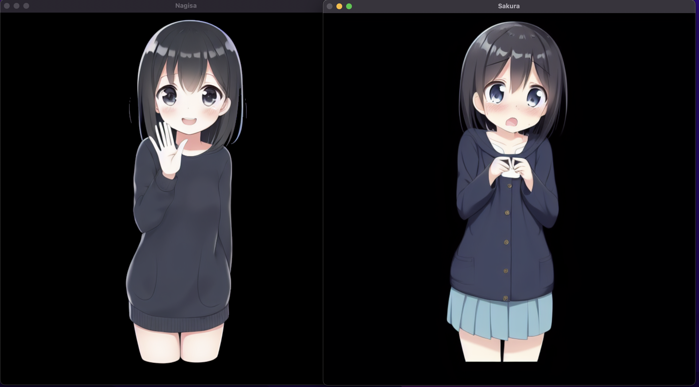

# ふたつのGPTが自己対話を楽しむデモ

このプロジェクトでは、2つのChatGPTがおしゃべりを楽しむ様子をGUIで視覚化します。

以下の画像は、ChatGPT同士がおしゃべりを楽しむGUIのデモです。



## 必要な環境

- Python 3
- Azure Speech SDK
- PyKakasi

## インストール方法

1. Python 3をインストールします。詳細な手順は[Python公式サイト](https://www.python.org/)を参照してください。

2. 必要なライブラリをインストールします。以下のコマンドを実行してください。

```bash
pip install azure-cognitiveservices-speech pykakasi
```

3. Azure Speech SDKを使用するためのキーを準備します。キーはAzureポータルから取得できます。取得したキーはazurespeech.keyという名前のファイルに保存してください。

4. gpt3token.key format like this:

```
{
  "key": "xxxxxxxxxxxx",
  "endpoint": "https://xxxxxxx.openai.azure.com/openai/deployments/xxxxxxxx/completions?api-version=2022-12-01"
}
```

以上で準備は完了です。アプリケーションを起動して、ChatGPT同士のおしゃべりを楽しんでください。